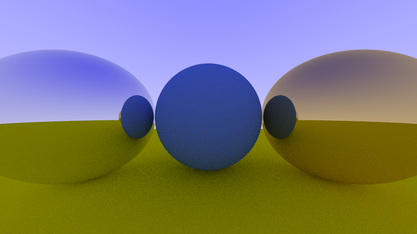
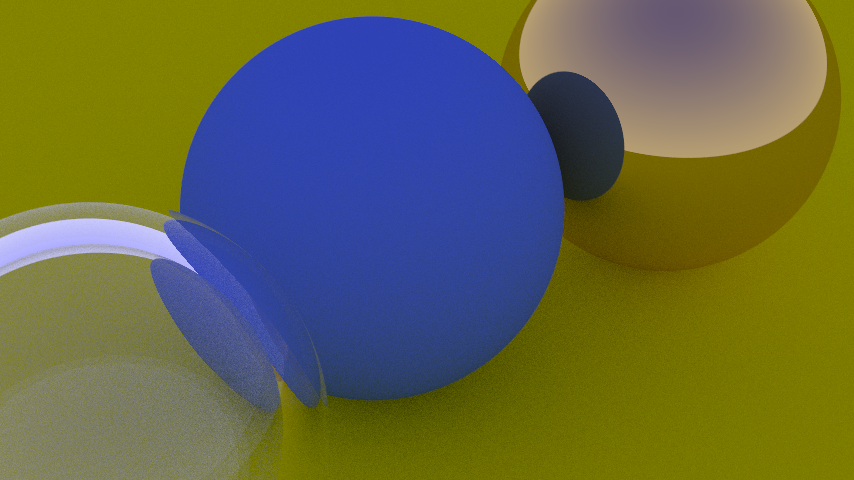
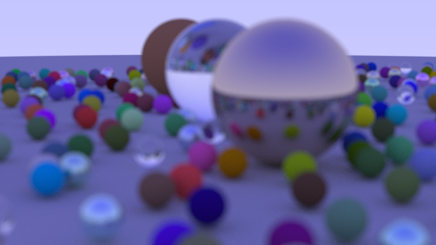

## Following [Ray Tracing in One Weekend](https://raytracing.github.io/books/RayTracingInOneWeekend.html#overview)

To run

```g++ -o out/rt -std=c++20 src/*.cpp && out/rt > out/image.ppm```

open ```out/image.ppm``` with a PPM image viewer

Example from [10.5 A Scene with Metal Spheres](https://raytracing.github.io/books/RayTracingInOneWeekend.html#metal/ascenewithmetalspheres)



Example from [12.2 Positionining and Orienting the Camera](https://raytracing.github.io/books/RayTracingInOneWeekend.html#positionablecamera/positioningandorientingthecamera)



My finishing render




